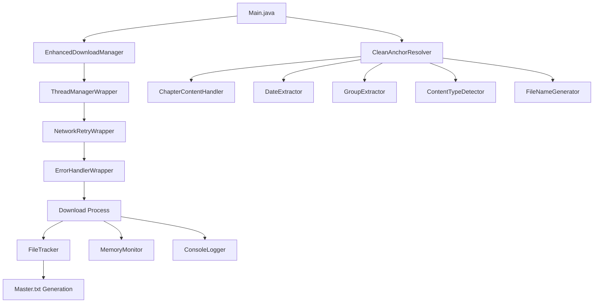

# ICAI PDF Downloader – Professional Edition

---

## 📚 Overview

This project is a **modular, robust Java application** designed to automate the downloading and organization of ICAI study material PDFs. It features smart file naming, duplicate handling, memory management, error recovery, and a clean architecture for easy maintenance and extension.

---

## 🚦 How the Project Works (Execution Flow)

### 1. **Main.java**
- **Entry point** of the application.
- Sets up configuration (URL, download directory, thread count).
- Instantiates all major components and wrappers.
- Starts the download process and triggers cleanup.

### 2. **Wrappers**
- **ErrorHandlerWrapper**: Catches and logs fatal errors, provides diagnostics.
- **NetworkRetryWrapper**: Retries downloads on network failures.
- **ThreadManagerWrapper**: Manages download execution, timeouts, and thread cleanup.

### 3. **Download Manager**
- **EnhancedDownloadManager**: Coordinates actual download tasks, manages thread pool, delegates file naming, and reports progress.

### 4. **Resolvers & Handlers**
- **CleanAnchorResolver**: Resolves file names for each PDF link using specialized handlers:
  - `ChapterContentHandler`: Chapter-specific naming.
  - `DateExtractor`: Exam session info.
  - `GroupExtractor`: Group/paper detection.
  - `ContentTypeDetector`: Type (MTP, RTP, etc.).
  - `FileNameGenerator`: Final name formatting.

### 5. **Tracking & Logging**
- **FileTracker**: Tracks downloaded files, handles duplicate naming, generates `Master.txt`.
- **ConsoleLogger**: Logs progress and status to the console.
- **MemoryMonitor**: Monitors and reports memory usage, triggers garbage collection if needed.

---

## 🗂️ **Project Structure**

```
src/main/java/org/pdf/downloader/
│
├── Main.java
├── core/
│   └── EnhancedDownloadManager.java
├── resolver/
│   ├── CleanAnchorResolver.java
│   ├── handlers/
│   │   ├── ChapterContentHandler.java
│   │   ├── DateExtractor.java
│   │   ├── GroupExtractor.java
│   │   ├── ContentTypeDetector.java
│   │   └── FileNameGenerator.java
│   └── tracking/
│       └── FileTracker.java
├── wrapper/
│   ├── ErrorHandlerWrapper.java
│   ├── NetworkRetryWrapper.java
│   └── ThreadManagerWrapper.java
├── observer/
│   └── ConsoleLogger.java
└── utils/
    ├── MemoryMonitor.java
    └── StringUtils.java
```

---

## 🧩 **How Classes Interact (Flowchart)**



---

## 🛠️ **How to Make Changes & Learn**

### **1. Change Download Source or Directory**
- Edit `baseUrl` and `downloadDir` in `Main.java`.

### **2. Add New File Naming Logic**
- Extend or modify `FileNameGenerator.java` or any handler in `resolver/handlers/`.

### **3. Improve Error Handling**
- Update logic in `ErrorHandlerWrapper.java` or `NetworkRetryWrapper.java`.

### **4. Enhance Memory Management**
- Tweak `MemoryMonitor.java` or cleanup logic in wrappers and trackers.

### **5. Customize Logging**
- Edit `ConsoleLogger.java` for different output styles or verbosity.

### **6. Add New Features**
- Follow the modular pattern: create a new handler, wrapper, or utility class.
- Register it in the appropriate place (e.g., add a new handler to `CleanAnchorResolver`).

---

## 💡 **Learning Tips**

- **Read each class’s comments** to understand its role.
- **Trace the flow** from `Main.java` through wrappers to the download manager and resolvers.
- **Experiment** by changing thread counts, adding new file types, or modifying naming rules.
- **Use the flowchart** to visualize how data and control move through the system.
- **Check `Master.txt`** after downloads to see how files are mapped and organized.

---

